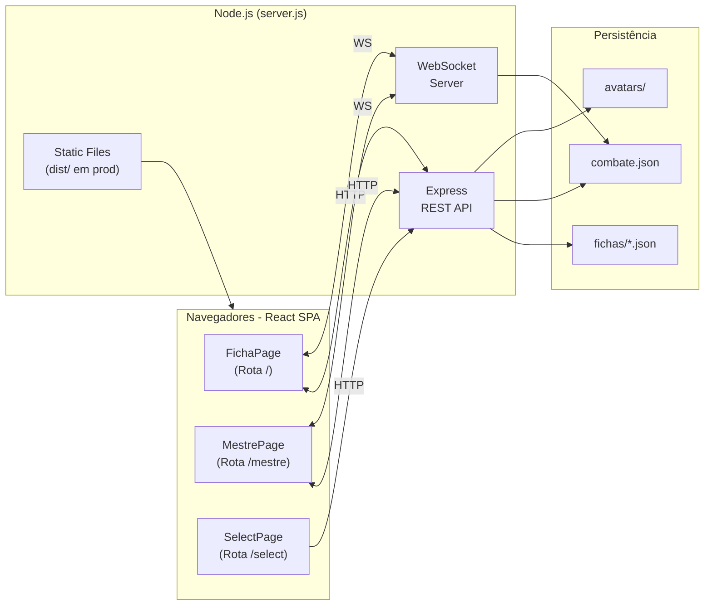

# ArcanaForge — Ficha Digital & Combat Tracker (Tormenta 20)

Sistema web completo para gerenciar fichas de personagem do RPG **Tormenta 20**, com tracker de combate em tempo real e sincronização entre múltiplos dispositivos via WebSocket.

Desenvolvido para uso em mesa (presencial ou online), permitindo que jogadores editem suas fichas enquanto o mestre gerencia o combate — tudo sincronizado automaticamente na rede local.

---

## Funcionalidades

### Ficha de Personagem (`/`)

- **Info Básica** — nome, avatar (upload), múltiplas classes com nível total, raça, origem, divindade, alinhamento, idade, tamanho, deslocamento, XP
- **Atributos** — FOR, DES, CON, INT, SAB, CAR com cálculo de modificadores e edição inline
- **Buffs** — lista de buffs ativáveis que alteram atributos e perícias em tempo real, com custo PM
- **PV / PM** — barras visuais estilo MMO, edição incremental (±), temporários, reset, redução de dano
- **Defesa** — cálculo automático com itens de proteção e penalidade de armadura
- **Ataques** — corpo-a-corpo e à distância, bônus customizáveis, custo em PM, botões "Usar" e "Duplicar" com animações visuais e efeitos sonoros (Web Audio API)
- **Magias** — lista com custo PM, aprimoramentos, modal de conjurar com cálculo dinâmico de custo
- **Perícias** — todas as perícias do T20 com cálculo automático (atributo + treino + buffs - penalidade de armadura), exibidas em drawer lateral
- **Habilidades & Poderes** — lista editável com origem, tipo e custo PM
- **Inventário** — itens, 4 slots de equipamento, moedas (TC, T$, TO), cálculo de carga
- **Proficiências e Efeitos Temporários** — campos de texto livre
- **Progressão** — histórico de progressão do personagem (drawer)
- **Anotações** — bloco de notas (drawer)
- **Logs** — registro de ações com tipo, PM gasto e timestamp (drawer)
- **Navegação por Seções** — barra sticky com IntersectionObserver e destaque da seção ativa
- **Seções Ocultáveis** — painel para mostrar/esconder seções conforme preferência
- **Auto-save** — salvamento automático com debounce (800ms) após cada alteração
- **Persistência na URL** — parâmetro `?char=` mantém o personagem selecionado

### Combat Tracker (`/mestre`)

- **Jogadores** carregados automaticamente das fichas salvas (PV, PM, avatar, classes)
- **Inimigos** adicionáveis dinamicamente com nome editável e PV customizável
- **Iniciativa** — campo numérico por participante com reordenação automática
- **Sistema de Turnos** — próximo turno, reset, indicador visual dourado no card ativo
- **Dano / Cura** — popover com input numérico ao clicar na barra de HP
- **Modo Mestre** (toggle) — esconde/mostra controles exclusivos do mestre (HP de inimigos, botões de adicionar/remover)
- **Feedback Visual de HP** — brilho amarelado (alerta) e avermelhado (crítico) nos cards de inimigos com limiares aleatórios para esconder a % exata dos jogadores
- **Ícones** — ícone da classe ao lado do nome dos jogadores, ícone de vilão para inimigos
- **Avatares** — faixa lateral com imagem do personagem (prioriza versão sem fundo)
- **Mini-ordem** — barra inferior fixa com avatares miniatura na ordem de iniciativa
- **Sincronização em tempo real** — todas as alterações (HP, turno, iniciativa, inimigos) são sincronizadas entre todos os clientes conectados

### Seleção de Personagem (`/select`)

- **Grid visual** de personagens salvos com avatar, nome e classes
- **Criar novo personagem** diretamente pela tela
- Redirecionamento para a ficha ao clicar no card

### Sincronização em Tempo Real (WebSocket)

- **Mestre → Ficha**: quando o mestre altera o PV de um jogador no tracker, a ficha do jogador atualiza automaticamente com toast de notificação
- **Ficha → Tracker**: quando o jogador altera PV/PM na sua ficha, o tracker do mestre reflete a mudança
- **Tracker → Tracker**: todas as alterações de combate (HP, iniciativa, turnos, inimigos) são sincronizadas entre todos os clientes conectados
- Reconexão automática em caso de desconexão

---

## Tecnologias

| Camada | Tecnologia |
|--------|------------|
| **Runtime** | Node.js |
| **Backend HTTP** | Express 4 |
| **WebSocket** | `ws` (WebSocketServer) |
| **Upload de arquivos** | Multer |
| **Frontend** | React 19, TypeScript, Vite |
| **Roteamento** | React Router v7 (SPA com 3 rotas) |
| **Estado** | React Context + useState |
| **Estilização** | CSS Modules (`.module.css`) com variáveis CSS |
| **Persistência** | Sistema de arquivos (JSON) — sem banco de dados |
| **Fontes** | Google Fonts (Inter) |
| **Estilo visual** | Dark mode, glassmorphism, acento dourado (temática fantasia/RPG) |

---

## Estrutura do Projeto

```
arcanaforge/
├── server.js              # Servidor Node: Express + WebSocket + API REST
├── package.json           # Dependências do backend
├── combate.json           # Estado persistido do combate (gerado automaticamente)
│
├── client/                # Frontend React (SPA)
│   ├── package.json       # Dependências do frontend
│   ├── vite.config.ts     # Config do Vite (proxy para :3000 em dev)
│   ├── tsconfig.json      # Config TypeScript
│   ├── index.html         # Entry point do Vite
│   └── src/
│       ├── main.tsx        # Bootstrap React + BrowserRouter
│       ├── App.tsx         # Definição de rotas
│       │
│       ├── api/
│       │   └── api.ts              # Wrappers fetch tipados para a API REST
│       │
│       ├── contexts/
│       │   ├── FichaContext.tsx     # Estado global da ficha (Provider + hook)
│       │   └── CombateContext.tsx   # Estado global do combate (Provider + hook)
│       │
│       ├── hooks/
│       │   ├── useWebSocket.ts     # Conexão WS com auto-reconnect
│       │   └── useAutoSave.ts      # Debounce save (800ms)
│       │
│       ├── utils/
│       │   ├── calculations.ts     # Cálculos T20 (atributos, perícias, defesa, etc.)
│       │   ├── sounds.ts           # Efeitos sonoros via Web Audio API
│       │   ├── animations.ts       # Animações de ataque (shake, flash, floating)
│       │   └── formatters.ts       # Utilitários de formatação (iniciais, cor de avatar)
│       │
│       ├── data/
│       │   ├── atributos.ts        # Constantes de atributos T20
│       │   ├── pericias.ts         # Config de perícias T20
│       │   └── constants.ts        # BUFF_TIPOS, SEC_NOMES, EQUIP_ICONS, etc.
│       │
│       ├── types/
│       │   ├── ficha.ts            # Interfaces TypeScript da ficha
│       │   └── combate.ts          # Interfaces TypeScript do combate
│       │
│       ├── styles/
│       │   ├── tokens.css          # Variáveis CSS (cores, fontes, sombras)
│       │   └── globals.css         # Reset e estilos base
│       │
│       ├── components/
│       │   ├── ui/                 # Componentes reutilizáveis de design
│       │   │   ├── Button/         # Botão com 7 variantes
│       │   │   ├── Section/        # Seção colapsável com título
│       │   │   ├── Modal/          # Overlay modal
│       │   │   ├── Drawer/         # Drawer lateral deslizante
│       │   │   ├── Toast/          # Sistema de notificações (Provider + hook)
│       │   │   ├── Badge/          # Badge inline (default, pm, gold)
│       │   │   └── BarraVida/      # Barra de HP/PM reutilizável
│       │   │
│       │   ├── layout/
│       │   │   ├── Topbar/         # Barra superior (genérica, usada em ficha e combate)
│       │   │   └── SectionNav/     # Navegação por seções com IntersectionObserver
│       │   │
│       │   ├── ficha/              # Componentes da ficha de personagem
│       │   │   ├── InfoBasica/     # Avatar + nome + classes + campos de info
│       │   │   ├── AtributosDefesa/# Grid de atributos + painel de defesa
│       │   │   ├── VidaMana/       # PV/PM com barras, controles e temporários
│       │   │   ├── BuffsList/      # Lista de buffs ativáveis
│       │   │   ├── AtaqueCard/     # Card de ataque com teste e dano
│       │   │   ├── AtaquesList/    # Seção de ataques
│       │   │   ├── AtaquesMini/    # Lista compacta de ataques/magias (quick-use)
│       │   │   ├── MagiaCard/      # Card de magia com aprimoramentos
│       │   │   ├── MagiasList/     # Seção de magias
│       │   │   ├── ModalConjurar/  # Modal de conjuração com custo dinâmico
│       │   │   ├── HabilidadesList/# Seção de habilidades e poderes
│       │   │   ├── PericiasList/   # Lista de perícias (drawer)
│       │   │   ├── Inventario/     # Inventário com carga e moedas
│       │   │   ├── Proficiencias/  # Textarea de proficiências
│       │   │   ├── EfeitosTemporarios/ # Textarea de efeitos
│       │   │   ├── ProgressaoDrawer/   # Drawer de progressão
│       │   │   ├── AnotacoesDrawer/    # Drawer de anotações
│       │   │   └── LogsDrawer/         # Drawer de logs de combate
│       │   │
│       │   ├── combate/            # Componentes do combat tracker
│       │   │   ├── CombateToolbar/ # Barra de ações (reset, ordenar, próximo turno)
│       │   │   ├── CombateCard/    # Card de participante (jogador ou inimigo)
│       │   │   ├── DanoPopover/    # Popover de dano/cura
│       │   │   └── MiniOrder/      # Barra de ordem de iniciativa (bottom bar)
│       │   │
│       │   └── select/
│       │       └── SelectGrid/     # Grid de seleção de personagens
│       │
│       └── pages/
│           ├── FichaPage/          # Rota / — ficha de personagem
│           ├── MestrePage/         # Rota /mestre — combat tracker
│           └── SelectPage/         # Rota /select — seleção de personagens
│
├── dist/                  # Build de produção do frontend (gerado por `npm run build`)
│
├── fichas/                # Um arquivo JSON por personagem (gerado automaticamente)
│   ├── Personagem1.json
│   └── Personagem2.json
│
├── avatars/               # Imagens de avatar enviadas pelos jogadores
│   ├── Personagem1.png
│   └── Personagem1_sem_fundo.png   # Variante sem fundo (opcional, usada no tracker)
│
└── assets/
    └── classes/           # Ícones de classe (PNG) — ex: guerreiro.png, mago.png
```

---

## Arquitetura



---

## API REST

| Método | Endpoint | Descrição |
|--------|----------|-----------|
| `GET` | `/api/fichas` | Lista nomes de todos os personagens |
| `GET` | `/api/fichas-resumo` | Resumo de cada ficha (nome, avatar, classes) para o grid de seleção |
| `GET` | `/api/fichas/:nome` | Carrega a ficha completa de um personagem |
| `POST` | `/api/fichas/:nome` | Salva/atualiza a ficha de um personagem |
| `DELETE` | `/api/fichas/:nome` | Exclui um personagem |
| `POST` | `/api/fichas/:nomeAntigo/renomear/:nomeNovo` | Renomeia um personagem |
| `GET` | `/api/combate` | Retorna o estado atual do combate |
| `POST` | `/api/combate` | Salva o estado do combate e notifica clientes via WebSocket |
| `POST` | `/api/avatar/:nome` | Upload de avatar (multipart, até 5 MB) |
| `GET` | `/api/avatar-sem-fundo/:nome` | URL do avatar sem fundo (se existir) |

---

## Mensagens WebSocket

| Mensagem (enviada) | Mensagem (recebida) | Descrição |
|--------------------|----------------------|-----------|
| `combate_update` | `combate_sync` | Atualiza estado completo do combate (inimigos, iniciativa, turno) |
| `ficha_hp_update` | `ficha_hp_sync` | Jogador alterou PV/PM na ficha → reflete no tracker do mestre |
| `mestre_hp_update` | `mestre_hp_sync` | Mestre alterou PV de jogador no tracker → reflete na ficha do jogador |

Na conexão inicial, o servidor envia `combate_sync` com o estado atual para o novo cliente.

---

## Como Rodar

### Pré-requisitos

- [Node.js](https://nodejs.org/) (v18 ou superior recomendado)

### Instalação

```bash
# Clone ou copie o projeto
cd arcanaforge

# Instale as dependências do backend
npm install

# Instale as dependências do frontend
cd client
npm install
```

### Desenvolvimento

Dois terminais são necessários:

```bash
# Terminal 1 — Backend (porta 3001 para não conflitar com ngrok)
npm run dev

# Terminal 2 — Frontend com hot-reload (porta 5173)
cd client
set BACKEND_PORT=3001 && npm run dev
```

Acesse `http://localhost:5173` no navegador. O Vite faz proxy automático de `/api`, `/avatars` e `/assets` para o backend.

> **Porta customizada:** A porta do backend é configurável via variável de ambiente `PORT`. O script `npm run dev` usa a porta 3001 por padrão. Para outra porta: `set PORT=4000 && node server.js`. O Vite usa `BACKEND_PORT` para saber onde o backend está rodando (padrão: 3000).

### Produção

```bash
# Build do frontend
cd client
npm run build

# Inicia o servidor (serve o build estático + API)
cd ..
npm start        # porta 3000 (padrão)
# ou com porta custom:
# set PORT=3001 && npm start
```

O servidor inicia na porta configurada (padrão **3000**) e serve tanto a SPA React quanto a API. Exibe no console:

```
Servidor rodando em http://localhost:3000
Acesso na rede: http://192.168.x.x:3000
```

### Rotas

| Página | URL |
|--------|-----|
| Ficha de Personagem | `http://localhost:3000/` |
| Combat Tracker | `http://localhost:3000/mestre` |
| Seleção de Personagem | `http://localhost:3000/select` |

### Acesso na Rede Local

Qualquer dispositivo na mesma rede pode acessar usando o IP exibido no console. Ideal para mesas presenciais onde cada jogador usa seu celular/tablet.

### Acesso Externo (opcional)

Para jogar com pessoas fora da rede local, use [ngrok](https://ngrok.com/):

```bash
ngrok http 3000
```

O ngrok fornecerá uma URL pública temporária que qualquer pessoa pode acessar.

---

## Padrões de Projeto

### Componentes UI Reutilizáveis

Padrões visuais recorrentes foram centralizados em componentes reutilizáveis em `components/ui/`:

| Componente | Uso |
|------------|-----|
| `Button` | 7 variantes: `default`, `add`, `remove`, `remove-sm`, `gold`, `ghost`, `primary` |
| `Section` | Seção colapsável com título h2 e botão de toggle |
| `Modal` | Overlay com backdrop blur e click-outside para fechar |
| `Drawer` | Painel lateral deslizante (perícias, progressão, anotações, logs) |
| `Toast` | Sistema de notificações com auto-dismiss (Provider + `useToast` hook) |
| `Badge` | Badge inline com variantes `default`, `pm` e `gold` |
| `BarraVida` | Barra de HP/PM com gradiente, usada tanto na ficha quanto no combate |

### Estado e Contextos

| Contexto | Escopo | Descrição |
|----------|--------|-----------|
| `FichaContext` | Ficha de personagem | Estado da ficha, auto-save, WebSocket (HP sync), CRUD de personagem |
| `CombateContext` | Combat tracker | Estado do combate, jogadores, turnos, WebSocket (combate sync) |
| `ToastProvider` | Notificações | Sistema de toasts com `showToast()` |

### Hooks Customizados

| Hook | Descrição |
|------|-----------|
| `useWebSocket` | Conexão WebSocket com auto-reconnect a cada 2s |
| `useAutoSave` | Debounce save de 800ms com suporte a renomear |

### Estilização

- **CSS Modules** (`.module.css`) para escopo por componente
- **Variáveis CSS** em `tokens.css` para temas e consistência
- **Sem frameworks CSS** — estilos custom para manter a identidade visual dark/dourada
- **Responsividade** — media queries nos módulos relevantes (breakpoints: 900px, 700px, 600px, 450px)

---

## Dependências

### Backend (`package.json`)

| Pacote | Versão | Uso |
|--------|--------|-----|
| `express` | ^4.21.0 | Servidor HTTP e API REST |
| `multer` | ^2.1.1 | Upload de avatares (multipart/form-data) |
| `ws` | ^8.20.0 | WebSocket para sincronização em tempo real |

### Frontend (`client/package.json`)

| Pacote | Versão | Uso |
|--------|--------|-----|
| `react` | ^19.2.4 | Biblioteca UI |
| `react-dom` | ^19.2.4 | Renderização DOM |
| `react-router-dom` | ^7.13.2 | Roteamento SPA |
| `typescript` | ^6.0.2 | Tipagem estática |
| `vite` | ^8.0.2 | Bundler e dev server |
| `@vitejs/plugin-react` | ^6.0.1 | Plugin React para Vite |
