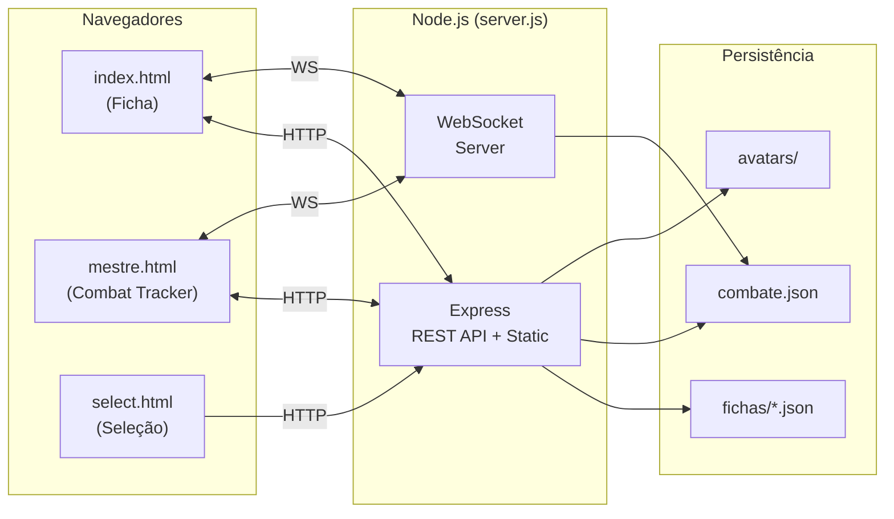

# Tormenta 20 — Ficha Digital & Combat Tracker

Sistema web completo para gerenciar fichas de personagem do RPG **Tormenta 20**, com tracker de combate em tempo real e sincronização entre múltiplos dispositivos via WebSocket.

Desenvolvido para uso em mesa (presencial ou online), permitindo que jogadores editem suas fichas enquanto o mestre gerencia o combate — tudo sincronizado automaticamente na rede local.

---

## Funcionalidades

### Ficha de Personagem (`index.html`)

- **Info Básica** — nome, avatar (upload), múltiplas classes com nível total, raça, origem, divindade, alinhamento, idade, tamanho, deslocamento, XP
- **Atributos** — FOR, DES, CON, INT, SAB, CAR com cálculo de modificadores
- **Buffs** — lista de buffs ativáveis que alteram atributos e perícias em tempo real
- **PV / PM** — barras visuais estilo MMO, edição incremental (±), temporários, reset, redução de dano
- **Defesa** — cálculo automático com itens de proteção e penalidade de armadura
- **Ataques** — corpo-a-corpo e à distância, bônus customizáveis, custo em PM, botões "Usar" e "Duplicar" com animações visuais e efeitos sonoros
- **Magias** — lista com custo PM, aprimoramentos, modal de conjurar
- **Perícias** — todas as perícias do T20 com cálculo automático (atributo + treino + buffs - penalidade de armadura), exibidas em drawer lateral
- **Habilidades & Poderes** — lista editável
- **Inventário** — itens, 4 slots de equipamento, moedas (TC, T$, TO), cálculo de carga
- **Proficiências e Efeitos Temporários** — campos de texto livre
- **Progressão** — histórico de progressão do personagem (drawer)
- **Anotações** — bloco de notas (drawer)
- **Logs** — registro de ações com tipo, PM gasto e timestamp (drawer)
- **Navegação por Seções** — barra lateral com scroll automático e destaque da seção ativa
- **Seções Ocultáveis** — painel para mostrar/esconder seções conforme preferência
- **Auto-save** — salvamento automático com debounce após cada alteração
- **Persistência na URL** — parâmetro `?char=` mantém o personagem selecionado

### Combat Tracker (`mestre.html`)

- **Jogadores** carregados automaticamente das fichas salvas (PV, PM, avatar, classes)
- **Inimigos** adicionáveis dinamicamente com nome editável e PV customizável
- **Iniciativa** — campo numérico por participante com reordenação automática
- **Sistema de Turnos** — próximo turno, reset, indicador visual dourado no card ativo
- **Dano / Cura** — popover com input numérico ao clicar na barra de HP
- **Modo Mestre** (toggle) — esconde/mostra controles exclusivos do mestre (HP de inimigos, botões de adicionar/remover)
- **Feedback Visual de HP** — brilho amarelado (alerta) e avermelhado (crítico) nos cards de inimigos com limiares aleatórios para esconder a % exata dos jogadores
- **Ícones** — ícone da classe ao lado do nome dos jogadores, ícone de vilão para inimigos
- **Avatares** — faixa lateral com imagem do personagem (prioriza versão sem fundo)
- **Mini-ordem** — barra inferior com avatares miniatura na ordem de iniciativa
- **Sincronização em tempo real** — todas as alterações (HP, turno, iniciativa, inimigos) são sincronizadas entre todos os clientes conectados

### Seleção de Personagem (`select.html`)

- **Grid visual** de personagens salvos com avatar, nome e classes
- **Criar novo personagem** diretamente pela tela
- Redirecionamento para a ficha com `?char=`

### Sincronização em Tempo Real (WebSocket)

- **Mestre → Ficha**: quando o mestre altera o PV de um jogador no tracker, a ficha do jogador atualiza automaticamente com toast de notificação
- **Ficha → Tracker**: quando o jogador altera PV/PM na sua ficha, o tracker do mestre reflete a mudança
- **Tracker → Tracker**: todas as alterações de combate (HP, iniciativa, turnos, inimigos) são sincronizadas entre todos os clientes conectados
- Reconexão automática em caso de desconexão

---

## Tecnologias

| Camada | Tecnologia |
|--------|------------|
| **Runtime** | Node.js |
| **Backend HTTP** | Express 4 |
| **WebSocket** | `ws` (WebSocketServer) |
| **Upload de arquivos** | Multer |
| **Frontend** | HTML5, CSS3, JavaScript vanilla (sem frameworks/bundlers) |
| **Persistência** | Sistema de arquivos (JSON) — sem banco de dados |
| **Fontes** | Google Fonts (Inter) |
| **Estilo visual** | Dark mode, glassmorphism, acento dourado (temática fantasia/RPG) |

---

## Estrutura do Projeto

```
web/
├── server.js              # Servidor Node: Express + WebSocket + API REST
├── package.json           # Dependências e script de inicialização
├── combate.json           # Estado persistido do combate (gerado automaticamente)
│
├── index.html             # Página principal: ficha de personagem
├── mestre.html            # Combat Tracker (mestre e jogadores)
├── select.html            # Seleção visual de personagens
│
├── js/
│   ├── api.js             # Cliente HTTP: wrappers fetch para a API REST
│   ├── data.js            # Dados de regra T20: perícias, ficha vazia, cálculos
│   ├── app.js             # Lógica da ficha: UI, eventos, save, WebSocket
│   └── mestre.js          # Lógica do combat tracker: cards, turnos, WebSocket
│
├── css/
│   ├── style.css          # Estilos globais (ficha + combate + componentes)
│   └── select.css         # Estilos da tela de seleção
│
├── assets/
│   └── classes/           # Ícones de classe (PNG) — ex: guerreiro.png, mago.png
│
├── fichas/                # Um arquivo JSON por personagem (gerado automaticamente)
│   ├── Personagem1.json
│   └── Personagem2.json
│
└── avatars/               # Imagens de avatar enviadas pelos jogadores (gerado automaticamente)
    ├── Personagem1.png
    └── Personagem1_sem_fundo.png   # Variante sem fundo (opcional, usada no tracker)
```

---

## Arquitetura



---

## API REST

| Método | Endpoint | Descrição |
|--------|----------|-----------|
| `GET` | `/api/fichas` | Lista nomes de todos os personagens |
| `GET` | `/api/fichas-resumo` | Resumo de cada ficha (nome, avatar, classes) para o grid de seleção |
| `GET` | `/api/fichas/:nome` | Carrega a ficha completa de um personagem |
| `POST` | `/api/fichas/:nome` | Salva/atualiza a ficha de um personagem |
| `DELETE` | `/api/fichas/:nome` | Exclui um personagem |
| `POST` | `/api/fichas/:nomeAntigo/renomear/:nomeNovo` | Renomeia um personagem |
| `GET` | `/api/combate` | Retorna o estado atual do combate |
| `POST` | `/api/combate` | Salva o estado do combate e notifica clientes via WebSocket |
| `POST` | `/api/avatar/:nome` | Upload de avatar (multipart, até 5 MB) |
| `GET` | `/api/avatar-sem-fundo/:nome` | URL do avatar sem fundo (se existir) |

---

## Mensagens WebSocket

| Mensagem (enviada) | Mensagem (recebida) | Descrição |
|--------------------|----------------------|-----------|
| `combate_update` | `combate_sync` | Atualiza estado completo do combate (inimigos, iniciativa, turno) |
| `ficha_hp_update` | `ficha_hp_sync` | Jogador alterou PV/PM na ficha → reflete no tracker do mestre |
| `mestre_hp_update` | `mestre_hp_sync` | Mestre alterou PV de jogador no tracker → reflete na ficha do jogador |

Na conexão inicial, o servidor envia `combate_sync` com o estado atual para o novo cliente.

---

## Como Rodar

### Pré-requisitos

- [Node.js](https://nodejs.org/) (v18 ou superior recomendado)

### Instalação

```bash
# Clone ou copie o projeto
cd web

# Instale as dependências
npm install
```

### Execução

```bash
npm start
```

O servidor inicia na porta **3000** e exibe no console:

```
Servidor rodando em http://localhost:3000
Acesso na rede: http://192.168.x.x:3000
```

### Acesso

| Página | URL |
|--------|-----|
| Ficha de Personagem | `http://localhost:3000` |
| Combat Tracker | `http://localhost:3000/mestre.html` |
| Seleção de Personagem | `http://localhost:3000/select.html` |

### Acesso na Rede Local

Qualquer dispositivo na mesma rede pode acessar usando o IP exibido no console. Ideal para mesas presenciais onde cada jogador usa seu celular/tablet.

### Acesso Externo (opcional)

Para jogar com pessoas fora da rede local, use [ngrok](https://ngrok.com/):

```bash
ngrok http 3000
```

O ngrok fornecerá uma URL pública temporária que qualquer pessoa pode acessar.

---

## Dependências

| Pacote | Versão | Uso |
|--------|--------|-----|
| `express` | ^4.21.0 | Servidor HTTP e API REST |
| `multer` | ^2.1.1 | Upload de avatares (multipart/form-data) |
| `ws` | ^8.20.0 | WebSocket para sincronização em tempo real |
